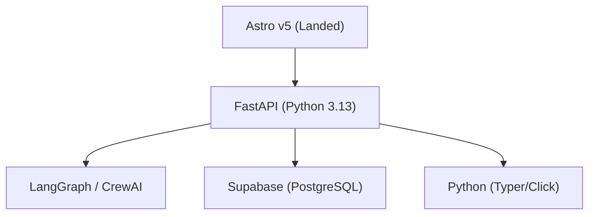

# NEXUS: Technical Brief
**Generated**: 2026-03-02 14:48
**Archetype**: AI-Orchestrated-NEXUS-v2

---

## 1. System Architecture

## 2. Technology Stack
| Layer | Technology | Role |
|---|---|---|
| Frontend | Astro v5 (Landed) | Static site generation |
| Backend | FastAPI (Python 3.13) | API & business logic |
| AI/Agent | LangGraph / CrewAI | Autonomous orchestration |
| Database | Supabase (PostgreSQL) | Persistence |
| Desktop | Python (Typer/Click) | Local automation |
| Edge | Hono (TypeScript) | Edge compute |
| Cache | Upstash Redis | Hot data layer |

## 3. Active Skills
- `hugging-face-cli`
- `nexus-migration-engine`
- `nexus-system-control`
- `nexus-visual-motion`

## 4. Decision Log (ADR History)
- **2026-02-28T08:43:00Z**: Stack expanded: Integrated Cloudflare (Pages/Workers), Astro v5, Hono, and Bun for Modern 2026 performance standards.
- **2026-02-28T08:50:00Z**: Stack expansion finalized: Added Fastify (High-load) and NestJS (Enterprise Core) as target architectures for scaling.
- **2026-02-28T08:52:00Z**: Full S-Tier Alignment: Integrated Vite, Vitest, Svelte, and Playwright based on State of JS 2025 report for maximum efficiency.
- **2026-03-01T15:05:00Z**: Integrated High-Tier Animation Stack: Added nexus-visual-motion skill (GSAP, Lenis, Threlte).
- **2026-03-02T09:35:00Z**: Implemented 'Codified Context' (arXiv:2602.20478): Initialized CONSTITUTION.md and SPECS/ hierarchy. Activated 3D-Forge capability.

## 5. Active Scripts

### builders/
- `scripts\builders\dtf_builder.py`
- `scripts\builders\inkjet_builder.py`

### maintenance/
- `scripts\maintenance\nexus_cleaner.py`

### motion/
- `scripts\motion\generate_motion_module.py`

### office/
- `scripts\office\DocumentFactory.py`
- `scripts\office\convert_pdf.py`
- `scripts\office\extract_context.py`
- `scripts\office\generate_concept.py`
- `scripts\office\generate_doc.py`
- `scripts\office\generate_marketing_kit.py`
- `scripts\office\generate_md_doc.py`
- `scripts\office\generate_nexus_assets.py`
- `scripts\office\generate_operator_pdf.py`
- `scripts\office\generate_presentation.py`
- `scripts\office\generate_presentation_landing.py`
- `scripts\office\generate_strategy.py`
- `scripts\office\generate_strategy_report.py`
- `scripts\office\nexus_researcher.py`
- `scripts\office\run_geo_analysis.py`
- `scripts\office\run_lighthouse_audit.py`
- `scripts\office\validate_docs.py`

### root/
- `scripts\freeze_nexus.py`
- `scripts\replicate_nexus.py`

### utils/
- `scripts\utils\adaptive_rag_search.py`
- `scripts\utils\analyze_token_usage.py`
- `scripts\utils\api_bridge.py`
- `scripts\utils\build_3d_bundle.py`
- `scripts\utils\build_final_white_laser.py`
- `scripts\utils\db_chat_agent.py`
- `scripts\utils\dispatcher.py`
- `scripts\utils\ide_bridge.py`
- `scripts\utils\init_database.py`
- `scripts\utils\mcp_launcher.py`
- `scripts\utils\pipe_bench.py`
- `scripts\utils\pipe_server.py`
- `scripts\utils\pipe_worker_pool.py`
- `scripts\utils\plan_and_execute_orchestrator.py`
- `scripts\utils\record_error.py`
- `scripts\utils\remove_bg.py`
- `scripts\utils\self_healing_agent.py`
